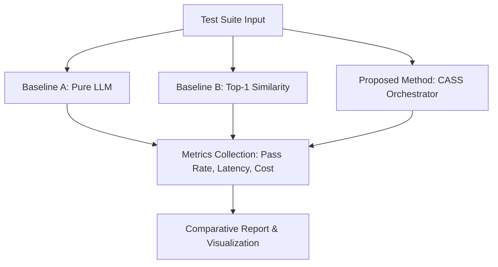

# KHUNG THIẾT KẾ SO SÁNH ĐỐI CHỨNG (BENCHMARK DESIGN)
# BỘ ĐIỀU PHỐI AG2 ORCHESTRATOR vs. BASELINES

Tài liệu này định nghĩa chi tiết thiết kế hệ thống thử nghiệm, so sánh và đối chứng hiệu năng giữa phương pháp điều phối đề xuất (Proposed Method) và các phương pháp cơ bản (Baselines).

---

## 1. MỤC TIÊU NGHIÊN CỨU (RESEARCH OBJECTIVES)

Mục tiêu của nghiên cứu đối chứng này nhằm đánh giá định lượng các khía cạnh sau:
* **Tỷ lệ sửa lỗi thành công (Pass Rate / Success Rate):** Khả năng sửa đổi chính xác mã nguồn để vượt qua kiểm thử của từng phương pháp.
* **Hiệu quả sử dụng tài nguyên (Cost Efficiency):** Lượng token tiêu thụ (Prompt, Completion, Total tokens) và tổng chi phí API (USD).
* **Độ trễ hệ thống (Latency/Performance):** Tổng thời gian hoàn thành tác vụ sửa lỗi (ms hoặc giây).
* **Khả năng tự phục hồi và ngắt vòng lặp (Robustness & Loop Prevention):** Đánh giá hiệu quả của cơ chế Loop Detection chuẩn hóa so với việc chạy tự do hoặc hết giới hạn bước cứng.

---

## 2. KIẾN TRÚC THỬ NGHIỆM & SO SÁNH (EVALUATION ARCHITECTURE)

Hệ thống benchmark sẽ kiểm thử đồng thời 3 cơ chế điều phối trên cùng một tập testcase chuẩn:



### 2.1 Baseline A: Pure LLM (Không sử dụng Kỹ năng định nghĩa trước)
* **Mô tả:** LLM nhận toàn bộ mã nguồn lỗi, stacktrace và thông điệp yêu cầu của người dùng, sau đó trực tiếp sinh ra mã nguồn đã được sửa lỗi chỉ sau một lượt gọi (Single-shot/Zero-shot).
* **Đặc điểm:** Không có kế hoạch từng bước, không sử dụng các công cụ/kỹ năng phụ trợ như `javac`, `read-code-context`.

### 2.2 Baseline B: Top-1 Similarity (Điều phối dựa trên độ tương đồng cao nhất)
* **Mô tả:** Hệ thống tính toán độ tương đồng ngữ nghĩa (Semantic Similarity) giữa mô tả lỗi của người dùng và danh sách các kỹ năng để chọn ra kỹ năng khớp nhất (Top-1). Sau đó, LLM sinh tham số và gọi duy nhất kỹ năng đó để sửa lỗi.
* **Đặc điểm:** Không có vòng lặp phản hồi, không có bước lập kế hoạch Planner vĩ mô và không kiểm tra sửa đổi động.

### 2.3 Proposed Method: CASS Orchestrator (Proposed AG2 Orchestrator)
* **Mô tả:** Hệ thống sử dụng LangGraph để điều phối quy trình khép kín:
  1. **Planner Node:** Nhận metadata tóm tắt từ Cache Tầng 1 để lập kế hoạch đa bước.
  2. **Select Skill Node:** Chọn kỹ năng tối ưu trong danh sách.
  3. **Execute Node:** Tải lười (Lazy Load) schema kỹ năng và bóc tách tham số. Gọi runtime vật lý (file đĩa thật, subprocess biên dịch thật).
  4. **Evaluate Node (Router):** Đánh giá kết quả, phát hiện vòng lặp dựa trên vân tay chữ ký lỗi chuẩn hóa (TASK_XA) và thực hiện can thiệp động (Dynamic Intervention) nếu cần.

---

## 3. ĐỊNH DẠNG DỮ LIỆU ĐẦU VÀO (TESTCASE DATA FORMAT)

Dữ liệu đầu vào của Test Suite được lưu trữ dưới dạng mảng JSON trong tệp `testcases.json`. Mỗi đối tượng testcase gồm các trường bắt buộc sau:

```json
[
  {
    "id": "TC_XX_Name",
    "filename": "Tên file nguồn cần sửa (ví dụ: LoginService.java)",
    "code_content": "Mã nguồn lỗi nguyên bản ban đầu",
    "stacktrace": "Log lỗi chi tiết hoặc stacktrace xuất ra từ hệ thống",
    "message": "Thông điệp mô tả yêu cầu sửa lỗi"
  }
]
```

---

## 4. CHỈ SỐ ĐÁNH GIÁ & ĐỊNH DẠNG ĐẦU RA (METRICS & OUTPUT FORMAT)

### 4.1 Các chỉ số đo lường chính (Key Performance Indicators)
1. **Pass Status (passed):** `True` nếu biên dịch không còn lỗi cú pháp/logic và file được cập nhật, `False` nếu ngược lại.
2. **Step Count (step_count):** Số node đã đi qua trong đồ thị trước khi dừng lại.
3. **Execution Latency (latency):** Thời gian thực thi đo bằng giây (s).
4. **Token Cost (cost):** Chi phí tài chính ước tính dựa trên số lượng Prompt và Completion token tiêu thụ (USD).
5. **Loop Termination (loop_prevented):** Ghi nhận có kích hoạt bẫy ngắt vòng lặp an toàn hay không.

### 4.2 Định dạng báo cáo kết quả đầu ra (benchmark_results.json)
Báo cáo kết quả chạy benchmark của các Baseline và Proposed Method sẽ được tổng hợp theo định dạng sau:

```json
{
  "timestamp": "2026-06-18T23:51:00Z",
  "summary": {
    "total_testcases": 10,
    "baseline_a": { "pass_rate": "40.0%", "avg_latency": "2.5s", "total_cost": "$0.0120" },
    "baseline_b": { "pass_rate": "60.0%", "avg_latency": "3.1s", "total_cost": "$0.0185" },
    "proposed_method": { "pass_rate": "90.0%", "avg_latency": "5.4s", "total_cost": "$0.0250" }
  },
  "details": [
    {
      "testcase_id": "TC_03_JavaMissingMethodStub",
      "baselines": {
        "baseline_a": { "passed": false, "latency": "2.2s", "cost": 0.0011, "steps": 1 },
        "baseline_b": { "passed": false, "latency": "2.8s", "cost": 0.0015, "steps": 2 }
      },
      "proposed_method": {
        "passed": true,
        "latency": "5.1s",
        "cost": 0.0035,
        "steps": 4,
        "loop_prevented": false,
        "history": [
          { "node": "plan_node", "latency_ms": 1100, "tokens": 850 },
          { "node": "execute_node", "latency_ms": 1500, "tokens": 1200 },
          { "node": "evaluate_node", "latency_ms": 800, "tokens": 600 }
        ]
      }
    }
  ]
}
```
