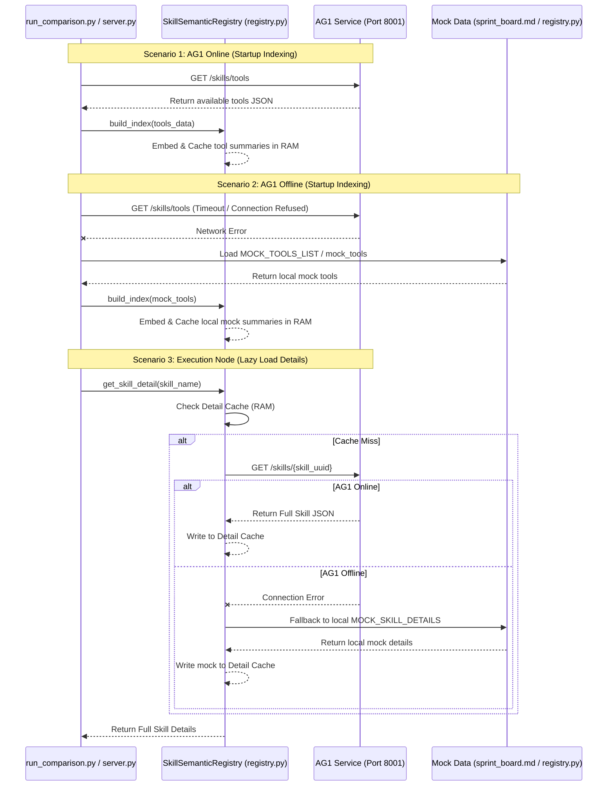

# Audit Report: AG1 Microservice Integration & Fallback Verification

This report documents the architectural audit of the communication flow between **AG2 (Testing & Orchestration)** and **AG1 (Skill Management)** under online and offline scenarios.

---

## 1. Actual Data Flow Diagram

---

## 2. API Caller Analysis

The following table details which files perform HTTP communication with the AG1 microservice:

| File Path | Function / Method | Endpoint Called | Purpose / Role |
|---|---|---|---|
| [server.py](file:///d:/PROJECT_GIT/gr1-prj/ai-software-engineering-agent/backend/services/skill_testing/server.py) | `get_cached_skills()` | `GET http://127.0.0.1:8001/skills/tools` | Fetches the master list of active skills to build the Vector Embeddings Index at startup. |
| [registry.py](file:///d:/PROJECT_GIT/gr1-prj/ai-software-engineering-agent/backend/services/skill_testing/core/registry.py) | `get_skill_detail()` | `GET http://127.0.0.1:8001/skills/{skill_id}` | Performs **Lazy Loading** to fetch full skill schemas (inputs, outputs, SOP instructions) only when execution is triggered. |
| [select_skill_node.py](file:///d:/PROJECT_GIT/gr1-prj/ai-software-engineering-agent/backend/services/skill_testing/core/select_skill_node.py) | `select_skill_node()` | `GET http://127.0.0.1:8001/skills/{skill_id}` | Fetches individual skill details during selection score evaluation (e.g. evaluating tags/levels). |

---

## 3. Fallback Mechanism Analysis

The fallback mechanism guarantees that both testing and evaluations run smoothly offline or during microservices downtime.

### Fallback Locations & Triggers

1.  **Orchestrator Registry Index Fallback:**
    *   **File:** [server.py](file:///d:/PROJECT_GIT/gr1-prj/ai-software-engineering-agent/backend/services/skill_testing/server.py) (inside `get_cached_skills()`) and [orchestrator.py](file:///d:/PROJECT_GIT/gr1-prj/ai-software-engineering-agent/backend/services/skill_testing/orchestrator.py) (fallback handler).
    *   **Trigger Condition:** Catching any connection exception (`httpx.ConnectError`, timeouts) or checking that the HTTP status code is not `200` when calling `GET /skills/tools`.
    *   **Action:** Returns a hardcoded array `mock_tools` representing core diagnostic tools.
2.  **Registry Detail Lazy Load Fallback:**
    *   **File:** [registry.py](file:///d:/PROJECT_GIT/gr1-prj/ai-software-engineering-agent/backend/services/skill_testing/core/registry.py) (inside `get_skill_detail()`).
    *   **Trigger Condition:** Catching network errors during `GET /skills/{skill_id}`.
    *   **Action:** Scans the `_summary_cache` to find matching metadata items or returns an empty dictionary.
3.  **Selector Evaluation Fallback:**
    *   **File:** [select_skill_node.py](file:///d:/PROJECT_GIT/gr1-prj/ai-software-engineering-agent/backend/services/skill_testing/core/select_skill_node.py) (inside `select_skill_node()`).
    *   **Trigger Condition:** Failing to download full skill schema from AG1.
    *   **Action:** References the local `MOCK_SKILL_DETAILS` dictionary to retrieve hardcoded raw SOP templates.

---

## 4. TODO: Eliminate Hardcoding & Standardize Integration

To ensure the benchmark suite dynamically adapts to changes in AG1 database entries, we must resolve these hardcoding issues:

*   [ ] **Standardize `run_comparison.py` Startup Indexing:** Currently, `run_comparison.py` calls `semantic_registry.build_index(MOCK_TOOLS_LIST)` directly. This completely bypasses AG1 even if it is online. We should modify it to first attempt fetching from `GET http://127.0.0.1:8001/skills/tools` and fallback to `MOCK_TOOLS_LIST` only on failure.
*   [ ] **Deduplicate `MOCK_SKILL_DETAILS`:** `MOCK_SKILL_DETAILS` is duplicated in both `select_skill_node.py` and other modules. We should extract mock data to a centralized configuration file (e.g. `services/skill_testing/core/mock_data.py`).
*   [ ] **Consolidate Lazy Loading Fallback:** In `select_skill_node.py`, it makes a separate HTTP call `GET /skills/{skill_id}` instead of using the registry's built-in lazy loader `semantic_registry.get_skill_detail(skill_id)`. We should change `select_skill_node.py` to call `await semantic_registry.get_skill_detail(skill_id)` to leverage the caching layer.
