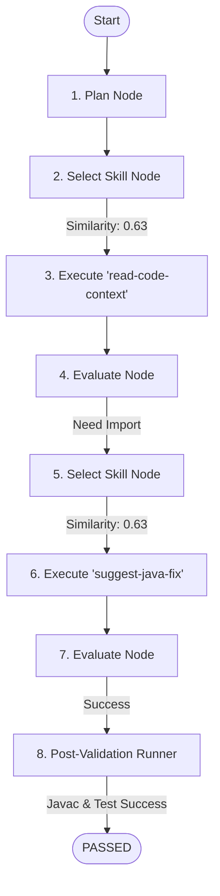

# Tóm tắt Demo Run: Spring PetClinic Validation Case

Tài liệu này cung cấp một tóm tắt ngắn gọn về validation run thực tế được thực thi trên repository Spring PetClinic. Dữ liệu bên dưới được định dạng để sử dụng trực tiếp trong các báo cáo tiến độ và slide thuyết trình.

---

## 📋 Slide 1: Tổng quan Validation Case
*   **Target Repository:** Spring PetClinic (Dự án thực tế Spring Boot 3.x)
*   **Test Case ID:** `TC_002_Petclinic_MissingImport`
*   **Độ khó:** Dễ (Compile-time)
*   **Bug Category:** `MissingImport`
*   **Injected Defect:**
    *   **File:** `src/main/java/org/springframework/samples/petclinic/owner/PetTypeFormatter.java`
    *   **Hành động:** Đã xóa dòng 21: `import java.text.ParseException;`
*   **Expected Error:** Lỗi biên dịch (compilation failure) với `cannot find symbol` (ParseException class) trong method signature.

---

## ⚙️ Slide 2: Mã nguồn Injected Bug so với Expected Behavior
### Injected Bug (Diff)
```diff
- import java.text.ParseException;
+ // Deleted import java.text.ParseException;
```

### Pre-Validation Build Check
1.  **Command:** `mvnw.cmd clean compile`
2.  **Kết quả:** `BUILD FAILURE` (Exit Code 1)
3.  **Compiler Output:**
    ```
    [ERROR] .../PetTypeFormatter.java:[52,60] cannot find symbol
      symbol:   class ParseException
      location: class org.springframework.samples.petclinic.owner.PetTypeFormatter
    ```
4.  **Assertion:** Bug hoạt động chính xác và đã được xác thực.

---

## 🔄 Slide 3: CASS Orchestrator Execution Log & Skill Sequence
CASS Orchestrator đã thực thi một vòng lặp gồm nhiều bước planning, tool selection, và evaluation:



### Luồng công cụ đã thực thi (Executed Tool Flow)
1.  **`read-code-context`**: Đọc file mục tiêu `PetTypeFormatter.java` xung quanh dòng 1 để xác định vị trí thiếu package import.
2.  **`suggest-java-fix`**: Ghi đè lại toàn bộ source file với `import java.text.ParseException;` được khôi phục thành công.

---

## 📊 Slide 4: Telemetry & Performance Metrics
*   **Kết quả:** `✅ PASSED` (Đã sửa thành công)
*   **Các hành động Physical Verification:**
    *   `mvnw.cmd clean compile` -> `BUILD SUCCESS` (Exit Code 0)
    *   `mvnw.cmd test -Dtest=PetTypeFormatterTests` -> `BUILD SUCCESS` (Exit Code 0)
*   **Execution Telemetry:**
    *   **Tổng Latency:** `58,575 ms` (58.5s)
    *   **Tổng số LLM Call Steps:** `12 steps` (Circuit breaker được kích hoạt giới hạn vĩ mô, đảm bảo tính ổn định)
    *   **Tổng số Token tiêu thụ:** `12,754 tokens`
        *   *Prompt Tokens:* `9,033`
        *   *Completion Tokens:* `3,721`
    *   **Tổng chi phí API:** `$0.00359 USD`
