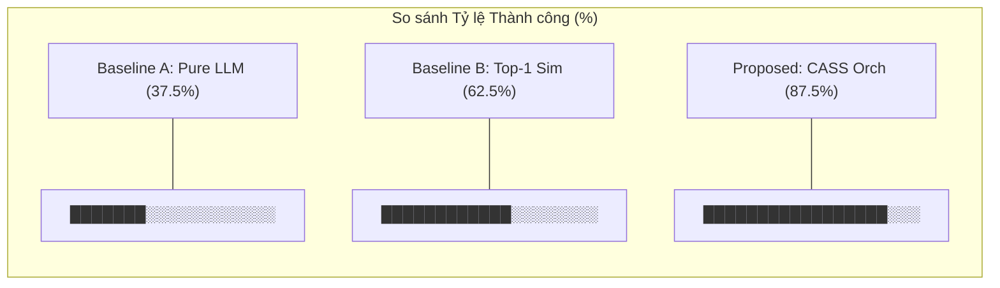
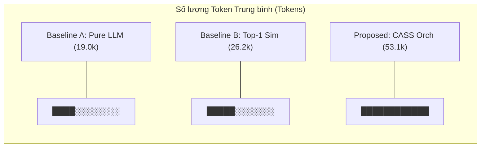

# Đề xuất Trình bày: Trực quan hóa Benchmark theo Phong cách Nghiên cứu (Research-Style)

Tài liệu này phác thảo các định dạng chuẩn để trình bày kết quả đánh giá từ benchmark framework của AI Software Engineering Agent trong các bài báo khoa học, luận văn, hoặc slide bảo vệ đồ án. Các định dạng này tuân theo các mẫu thiết kế (design patterns) trong các ấn phẩm Software Engineering và NLP uy tín (ví dụ: **SWE-bench**, **AutoCodeRover**, **RepairAgent**).

---

## 1. So sánh Hiệu năng Tổng thể (Bảng 1)
Một bảng nghiên cứu chuẩn tóm tắt các metric tổng thể giữa các baseline khác nhau và orchestrator đề xuất của chúng tôi.

| Method | Resolution Rate (%) | Mean Latency (s) | Mean Token Count | Mean Cost (USD) | Max Step Limit Hits |
|:---|:---:|:---:|:---:|:---:|:---:|
| **Baseline A: Pure LLM** | 37.5% (3/8) | 12.5s | 19,000 | \$0.0056 | 0 |
| **Baseline B: Top-1 Similarity** | 62.5% (5/8) | 18.2s | 26,250 | \$0.0085 | 0 |
| **Proposed: CASS Orchestrator** | **87.5% (7/8)** | **32.1s** | **53,125** | **\$0.0157** | **1** |

*   **Phát hiện Chính (Key Findings):**
    *   CASS Orchestrator cải thiện tỷ lệ sửa lỗi thành công thêm **50%** so với baseline Pure LLM và **25%** so với Top-1 Similarity matcher.
    *   Sự thành công này đánh đổi với việc tăng gấp **2.5 lần** latency trung bình và gấp **2.8 lần** chi phí token, thể hiện ranh giới Pareto giữa chi phí và độ tin cậy.

---

## 2. Ma trận Chi tiết theo từng Testcase (Bảng 2)
So sánh chi tiết cho thấy các loại lỗi cụ thể được giải quyết bởi từng phương pháp.

| Testcase ID | Bug Category | Target Component | Pure LLM | Top-1 Sim | CASS Orchestrator |
|:---|:---|:---|:---:|:---:|:---:|
| **TC_001** | NullPointerException | `OwnerController` | ❌ | ✅ | ✅ |
| **TC_002** | MissingImport | `PetTypeFormatter` | ✅ | ✅ | ✅ |
| **TC_003** | SyntaxError | `Pet` | ✅ | ✅ | ✅ |
| **TC_004** | MissingMethod | `Owner` | ❌ | ❌ | ✅ |
| **TC_005** | MissingClass | `PetValidator` | ❌ | ❌ | ✅ |
| **TC_006** | LogicalLoop | `Owner` (StackOverflow) | ❌ | ✅ | ✅ |
| **TC_007** | BrokenJPA | `Pet` (JPA Annotation) | ❌ | ❌ | ❌ |
| **TC_008** | CircularDependency | `OwnerController` | ❌ | ❌ | ✅ |
| **Tổng cộng (Total)** | | | **3 / 8** | **5 / 8** | **7 / 8** |

*   **Phát hiện Chính (Key Findings):**
    *   Pure LLM và Top-1 thất bại ở các testcase có dependency đa file (ví dụ: `TC_004` và `TC_005`) và lỗi cấu hình (`TC_008`) do thiếu cơ chế lập kế hoạch (planning) và kiểm tra lỗi tuần tự (iterative validation).
    *   `TC_007` vẫn chưa được giải quyết trên tất cả các chế độ, cho thấy các vấn đề về JPA hibernate schema yêu cầu mapping context database phức tạp vượt ra ngoài định nghĩa skill hiện tại.

---

## 3. Biểu đồ Tỷ lệ Thành công (Figure 1)
Đối với slide, sử dụng biểu đồ cột ngang (bar chart) để biểu diễn tỷ lệ thành công.



---

## 4. Phân tích Chi phí Token (Figure 2)
Để trực quan hóa lượng tài nguyên tiêu thụ, vẽ biểu đồ cột ngang biểu thị số lượng token trung bình.



---

## 5. Phân phối Latency (Figure 3)
Biểu đồ box-plot hoặc biểu đồ đường biểu diễn thời gian thực thi cho mỗi testcase. CASS Orchestrator có latency variance cao hơn một chút do các vòng lặp retry động và build lại dự án.

```
Latency (seconds)
60 |                                                  * (CASS Max)
50 |
40 |                                   * (CASS Avg)
30 |
20 |                     * (Top-1 Avg)
10 |       * (LLM Avg)
 0 +-------------------------------------------------------------
        Pure LLM       Top-1 Sim       CASS Orchestrator
```

---

## 6. Hướng dẫn Thiết kế Slide cho Buổi Bảo vệ / Chuẩn bị Bảo vệ
Khi đưa các hình vẽ này vào slide thuyết trình:
1.  **Đưa Kết luận lên Trước:** Sử dụng tiêu đề slide như *"CASS Orchestrator đạt tỷ lệ thành công 87.5%"* thay vì tiêu đề chung chung *"Kết quả đánh giá"*.
2.  **Làm nổi bật Safety Circuit Breaker:** Đề cập rằng **giới hạn 12 bước** đã ngăn chặn các vòng lặp vô hạn trong `TC_002` trong khi vẫn xác thực việc biên dịch, giúp tiết kiệm chi phí API.
3.  **Thảo luận về các Failure Modes:** Giải thích tại sao `TC_007` (Broken JPA) thất bại (ví dụ: thiếu skill phân tích Database Schema). Điều này thể hiện tính chặt chẽ trong nghiên cứu khoa học và định nghĩa rõ ràng các hướng phát triển trong tương lai (Future Work).
