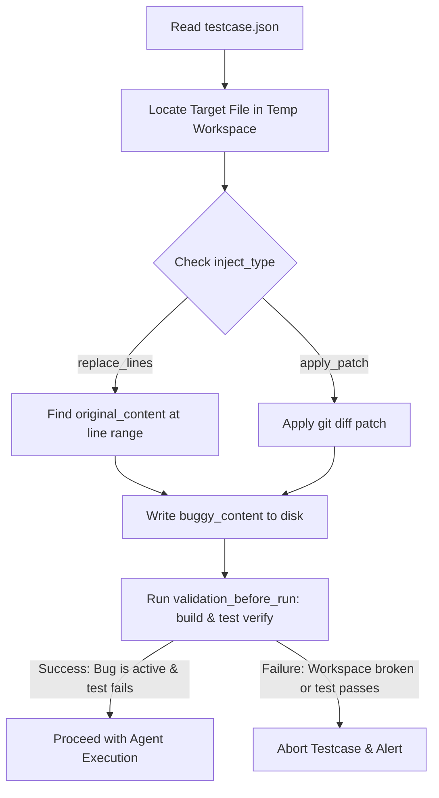
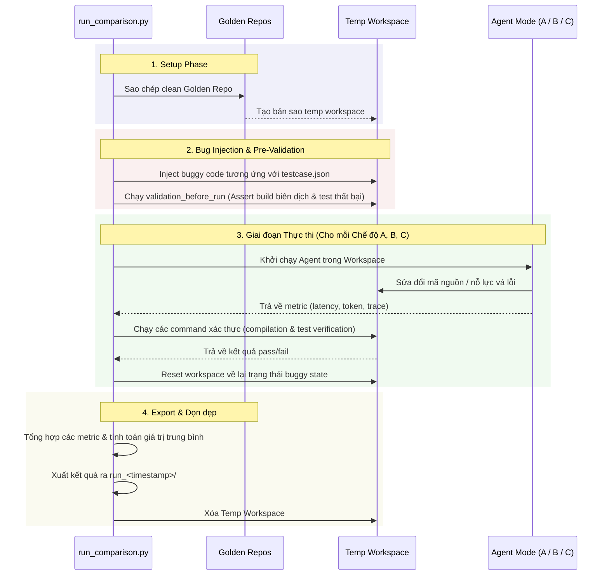

# Thiết kế Kiến trúc Chi tiết: Benchmark Framework cho AI Software Engineering Agent

Tài liệu này phác thảo thiết kế kiến trúc cho một framework đánh giá và benchmark chuẩn hóa của AI Software Engineering Agent. Framework này cho phép so sánh giữa các cấu hình orchestrator khác nhau và các baseline method trên các repository thực tế, cụ thể là nhắm mục tiêu vào repository **Spring PetClinic**.

---

## 1. Thiết kế Cấu trúc Thư mục

Benchmark framework sẽ nằm dưới `services/skill_testing/` và tuân theo một cấu trúc thư mục phân tách (decoupled) nghiêm ngặt.

```
ai-software-engineering-agent/backend/services/skill_testing/
├── benchmark_repos/                  # Bản sao chỉ đọc "golden copies" của các target repository
│   └── spring-petclinic/             # Bản sao clean git clone của Spring PetClinic (v3.2.0+)
├── testcases/                        # Các testcase đánh giá chuẩn hóa
│   ├── TC_001_Petclinic_NPE/
│   │   ├── testcase.json             # Cấu hình chi tiết bug, các command, cấu hình workspace
│   │   ├── expected.json             # Các mục tiêu xác thực (biên dịch, test suite, output)
│   │   └── patch.diff                # Bản vá tham chiếu (sửa lỗi thủ công chuẩn của con người)
│   ├── TC_002_Petclinic_MissingImport/
│   │   ├── testcase.json
│   │   ├── expected.json
│   │   └── patch.diff
│   └── ...
└── benchmark_results/                # Kết quả thực thi benchmark
    └── run_20260619_120000/          # Nhóm các run thực thi theo dấu thời gian (timestamp)
        ├── run_config.json           # Các tham số của run (model, temperature, v.v.)
        ├── summary.json              # Các metric tổng hợp so sánh cả ba chế độ (mode)
        ├── pure_llm_details.json     # Trace và chi tiết cho Baseline A
        ├── top1_similarity_details.json # Trace và chi tiết cho Baseline B
        └── cass_orchestrator_details.json # Trace và chi tiết cho CASS Orchestrator
```

### Vai trò & Nhiệm vụ của Thư mục

1. **`benchmark_repos/` (Read-only Golden Repositories)**
   - **Vai trò:** Đóng vai trò là nguồn sự thật (source of truth) cho các target benchmark.
   - **Lập luận:** Việc lưu trữ một phiên bản cục bộ, đã build đầy đủ và clean của các dự án mục tiêu (ví dụ: các Maven dependency được tải xuống trước qua `./mvnw clean compile`) giúp tránh overhead mạng và sự chậm trễ khi tải dependency trong quá trình thực thi. Runner không bao giờ thực hiện thay đổi trực tiếp vào các thư mục này.

2. **`testcases/` (Test Suite Specification)**
   - **Vai trò:** Khai báo các bug cần inject, chỉ thị (instruction) cho agent, và các điều kiện xác thực (validation).
   - **Lập luận:** Giữ cho mỗi testcase độc lập trong thư mục con riêng của nó với các file JSON và file diff phân tách rõ ràng để đảm bảo tính modular. Việc thêm hoặc bớt một testcase đơn giản là thêm hoặc xóa một thư mục.

3. **`benchmark_results/` (Research & Metric Logs)**
   - **Vai trò:** Lưu trữ lâu dài telemetry chi tiết, lượng tài nguyên tiêu thụ, và nhật ký thành công (success logs).
   - **Lập luận:** Nhóm các kết quả theo các run thực thi (`run_<timestamp>`) cho phép phân tích lịch sử, báo cáo so sánh, và khả năng audit cho các bài báo nghiên cứu (research paper).

---

## 2. Chiến lược Inject Bug (Bug Injection Strategy)

Để đảm bảo tính tái lập (reproducibility) và ngăn ngừa việc làm ô nhiễm repository thủ công, runner sẽ tự động hóa việc inject bug. Mã nguồn gốc trong `benchmark_repos/` vẫn giữ chế độ chỉ đọc (read-only).



### Cơ chế Injection (Injection Mechanics)
Mỗi testcase chỉ định một file mục tiêu (target file) và một công thức injection sử dụng một trong hai loại:
*   `replace_lines`: Thay thế một khối mã trong một phạm vi dòng mục tiêu. Bộ injector trước tiên xác minh rằng các dòng khớp chính xác với `original_content` trước khi thay thế chúng bằng `buggy_content`.
*   `apply_patch`: Áp dụng trực tiếp một file git diff patch vào workspace bằng cách sử dụng một công cụ patch hoặc các command git tiêu chuẩn.

### Xác thực Trước khi Chạy (`validation_before_run`)
Trước khi bắt đầu bất kỳ hoạt động thực thi nào của agent, runner sẽ thực hiện một bước **sanity check**:
1. Nó biên dịch repository với bug đã được inject để đảm bảo không có lỗi cú pháp không liên quan nào tồn tại.
2. Nó thực thi unit test cụ thể liên quan đến bug và xác nhận rằng nó phải **thất bại** (fail).
3. Điều này đảm bảo rằng bug đã hoạt động thành công, có thể tái lập, và sự thành công sau đó là do các thay đổi của agent chứ không phải do test flakiness.

### Các Ví dụ về Heuristics Inject Bug

#### 1. NullPointerException (NPE) Injection
*   **Phương pháp:** Định vị một method thực hiện dereference một đối tượng biến (ví dụ: `lastName.trim()`). Thay thế mã bảo vệ null (null-guard) hoặc mã khởi tạo biến bằng việc dereference trực tiếp.
*   **Biểu diễn Metadata:**
    ```json
    "bug_injection": {
      "target_file": "src/main/java/org/springframework/samples/petclinic/owner/OwnerController.java",
      "inject_type": "replace_lines",
      "target_lines": { "start": 81, "end": 84 },
      "original_content": "if (owner.getLastName() == null) {\n    owner.setLastName(\"\");\n}",
      "buggy_content": "String lastName = owner.getLastName();\nString trimmed = lastName.trim();"
    }
    ```

#### 2. Missing Import Injection
*   **Phương pháp:** Loại bỏ một khai báo `import` duy nhất của một class hoặc thư viện được sử dụng bên trong file, khiến quá trình biên dịch thất bại với lỗi "cannot find symbol".
*   **Biểu diễn Metadata:**
    ```json
    "bug_injection": {
      "target_file": "src/main/java/org/springframework/samples/petclinic/owner/PetTypeFormatter.java",
      "inject_type": "replace_lines",
      "target_lines": { "start": 21, "end": 21 },
      "original_content": "import java.text.ParseException;",
      "buggy_content": "// Injected: Deleted import java.text.ParseException;"
    }
    ```

#### 3. Missing Method Injection
*   **Phương pháp:** Đổi tên hoặc xóa một method bên trong một model phụ thuộc hoặc một class tiện ích (ví dụ: `getPet`), nhưng vẫn giữ nguyên lời gọi từ controller gọi nó, gây ra lỗi biên dịch (compiler error).
*   **Biểu diễn Metadata:**
    ```json
    "bug_injection": {
      "target_file": "src/main/java/org/springframework/samples/petclinic/owner/Owner.java",
      "inject_type": "replace_lines",
      "target_lines": { "start": 120, "end": 122 },
      "original_content": "public Pet getPet(String name, boolean ignoreNew) {",
      "buggy_content": "public Pet getPetLegacy(String name, boolean ignoreNew) {"
    }
    ```

#### 4. Missing Class Injection
*   **Phương pháp:** Xóa hoàn toàn một file class (ví dụ: `PetValidator.java`) hoặc đổi tên class bên trong file trong khi các component khác (như `PetController.java`) vẫn khởi tạo nó.
*   **Biểu diễn Metadata:**
    ```json
    "bug_injection": {
      "target_file": "src/main/java/org/springframework/samples/petclinic/owner/PetValidator.java",
      "inject_type": "replace_lines",
      "target_lines": { "start": 28, "end": 28 },
      "original_content": "public class PetValidator implements Validator {",
      "buggy_content": "public class PetValidatorOld implements Validator {"
    }
    ```

---

## 3. Vòng đời của Workspace (Workspace Lifecycle)

Để đảm bảo cách ly thực nghiệm nghiêm ngặt và bảo toàn trạng thái sạch sẽ, benchmark hoạt động trên một vòng đời workspace tạm thời.

```
benchmark_repos/ (Golden Copy)
     │
     ▼ (Sao chép sâu thư mục / Deep copy directory)
temporary workspace/ (Workspace thực thi duy nhất)
     │
     ▼ (Inject bug)
buggy workspace/
     │
     ├───► [Baseline A: Pure LLM] ───► Validate & Thu thập Metric ───► Khôi phục về Buggy State
     ├───► [Baseline B: Top-1] ──────► Validate & Thu thập Metric ───► Khôi phục về Buggy State
     └───► [Proposed Method: CASS] ──► Validate & Thu thập Metric ───► Hủy Workspace
```

### Các Giai đoạn Chi tiết của Vòng đời

| Giai đoạn | Hành động | Mục đích / Lập luận |
|---|---|---|
| **1. Setup** | Sao chép bản clean `benchmark_repos/<repo>` sang một đường dẫn tạm thời (ví dụ: `services/skill_testing/workspace_temp/run_120/`). | **Đảm bảo Read-Only:** Đảm bảo repository gốc không bao giờ bị đột biến bởi agent. Ngăn ngừa các sự cố khóa file và ô nhiễm chéo giữa các bài test. |
| **2. Bug Injection** | Áp dụng thay thế dòng hoặc diff patch vào temp workspace. | **Tính Tái Lập (Reproducibility):** Tạo ra điểm bắt đầu giống hệt nhau cho mỗi lần chạy baseline model. |
| **3. Pre-Validation** | Thực hiện kiểm tra biên dịch và xác minh rằng các test suite thất bại do bug đã inject. | **Sanity Checking:** Xác nhận bug đang hoạt động và ngăn ngừa các kết quả dương tính giả khi các test vượt qua mà không có đóng góp của agent. |
| **4. Agent Execution** | Thực thi chế độ agent được chọn (A, B, hoặc Proposed) bằng cách trỏ đường dẫn môi trường workspace của nó sang workspace tạm thời. | **Cách ly Thực thi:** Giới hạn quyền sửa đổi file của agent hoàn toàn trong sandbox workspace. |
| **5. Post-Validation** | Thực thi các command xác thực mong muốn (`mvnw compile`, `mvnw test`). | **Các Khẳng định Vật lý (Physical Assertions):** Đánh giá xem thay đổi mã nguồn của agent có biên dịch thành công và vượt qua các unit test hay không. |
| **6. Metrics Collection** | Lấy các metric về latency, tính toán chi phí token, đăng ký kết quả trạng thái cuối cùng. | **Dữ liệu Telemetry:** Ghi nhận các metric về hiệu năng. |
| **7. Rolling Recovery** | Thực hiện lệnh `git checkout -- .` và `git clean -fd` bên trong temp workspace để đưa nó về lại trạng thái buggy state. | **Kiểm thử Đa Baseline:** Cho phép kiểm thử các baseline khác bắt đầu từ cùng một chữ ký lỗi (bug signature). |
| **8. Destruction** | Xóa thư mục workspace tạm thời một cách đệ quy. | **Quản lý Lưu trữ:** Dọn dẹp các build artifact (ví dụ: các thư mục `target/`), nếu không có thể chiếm hàng gigabyte dung lượng đĩa cứng. |

---

## 4. Định nghĩa các Benchmark Baseline

Hệ thống đánh giá so sánh ba chế độ thực thi agent riêng biệt trên cùng một test suite.

### Ma trận So sánh các Chế độ (Mode Comparison Matrix)

| Thuộc tính | Baseline A: Pure LLM | Baseline B: Top-1 Similarity | Phương pháp Đề xuất: CASS Orchestrator |
|---|---|---|---|
| **Heuristics** | Sửa mã trực tiếp single-shot. | Tra cứu và thực thi skill theo ngữ nghĩa. | Vòng lặp khép kín đầy đủ được dẫn dắt bởi LangGraph. |
| **Planner Node** | ❌ Không | ❌ Không | ✔️ Macro planning sử dụng cache index. |
| **Skill Selection** | ❌ Không | ✔️ Khớp điểm semantic similarity Top-1. | ✔️ Lựa chọn động nhiều skill khác nhau. |
| **Evaluator Loop** | ❌ Không | ❌ Không | ✔️ Micro-evaluation sau mỗi hành động. |
| **Circuit Breaker** | ❌ Không (Single call) | ❌ Không (Single execution) | ✔️ Ngăn ngừa vòng lặp vô hạn qua hashing chữ ký. |

---

### 1. Baseline A: Pure LLM (Direct Patch)
*   **Đầu vào:** Mô tả tác vụ (task description), nội dung file lỗi, và stacktrace lỗi.
*   **Luồng Thực thi:**
    1. Một prompt duy nhất được gửi đến LLM mô tả chi tiết về bug và yêu cầu file đã sửa hoặc một khối mã bản vá (patch block).
    2. Runner phân tích cú pháp mã nguồn được tạo ra và ghi đè lên file mục tiêu trong temp workspace.
*   **Các Metric Thu thập:** Tổng latency, tổng số token, chi phí (USD).
*   **Ưu điểm & Hạn chế:**
    *   *Ưu điểm:* Thời gian thực thi nhanh; chi phí token trên mỗi lần chạy thấp.
    *   *Hạn chế:* Thường thất bại đối với các dependency nhiều file, các điều chỉnh cú pháp phức tạp, và thiếu các vòng lặp xác thực để tự sửa lỗi chính tả.

### 2. Baseline B: Top-1 Similarity (Direct Skill Execution)
*   **Đầu vào:** Mô tả tác vụ, stacktrace, file mục tiêu, và chỉ mục của Skills Registry.
*   **Luồng Thực thi:**
    1. Tính toán độ tương đồng ngữ nghĩa cosine (cosine semantic similarity) giữa stacktrace và metadata (tên, mô tả, tag) của tất cả các skill đã đăng ký.
    2. Xác định skill có điểm tương đồng cao nhất (Top-1) (ví dụ: `debug-java-null-pointer`).
    3. Yêu cầu LLM trích xuất các tham số cho skill này và thực thi nó trực tiếp trên workspace.
    4. Ghi các thay đổi xuống đĩa cứng.
*   **Các Metric Thu thập:** Tổng latency, tổng số token, chi phí (USD), ID của skill được chọn.
*   **Ưu điểm & Hạn chế:**
    *   *Ưu điểm:* Sử dụng các công cụ chuyên biệt đã được định nghĩa trước; giải quyết các lỗi tập trung phổ biến một cách dễ dàng.
    *   *Hạn chế:* Thiếu ngữ cảnh lập kế hoạch (planning) và đánh giá (evaluation). Nếu skill được chọn đầu tiên bị sai hoặc yêu cầu các bước tiên quyết (ví dụ: đọc file class phụ thuộc trước), việc thực thi sẽ thất bại ngay lập tức.

### 3. Phương pháp Đề xuất: CASS Orchestrator (Full Graph Orchestration)
*   **Đầu vào:** Toàn bộ AgentState chứa lịch sử lỗi, registry cache, các tham số chi phí, và các biến thực thi.
*   **Luồng Thực thi:**
    1. **Plan Node:** Tổng hợp các yêu cầu tác vụ thành một kế hoạch gồm nhiều bước.
    2. **Select Skill Node:** Gợi ý các công cụ thích hợp dựa trên trạng thái hiện tại.
    3. **Execute Node:** Chạy skill, cập nhật file trên đĩa cứng.
    4. **Evaluate Node:** Đánh giá compile log, theo dõi chi phí/latency, và kiểm tra các vòng lặp qua chữ ký.
    5. **Replan (nếu cần):** Điều chỉnh động lộ trình dựa trên các lỗi mới phát sinh.
*   **Các Metric Thu thập:** Chi tiết ở cấp độ node (latency, token, chi phí trên mỗi bước), số lượng bước, các trigger kết thúc vòng lặp.
*   **Ưu điểm & Hạn chế:**
    *   *Ưu điểm:* Tính phục hồi cực cao; giải quyết các lỗi biên dịch và dependency phức tạp nhiều bước thông qua các vòng lặp phản hồi tích cực; kết thúc an toàn nếu phát hiện vòng lặp vô hạn.
    *   *Hạn chế:* Tiêu thụ lượng token lớn; latency thực thi dài hơn do nhiều lần gọi LLM.

---

## 5. Schema Testcase (`testcase.json`)

File `testcase.json` chỉ định repository mục tiêu, cách inject bug, stacktrace lỗi được cung cấp cho agent, và các command cần chạy.

### Đặc tả JSON Schema

```json
{
  "testcase_id": "TC_001_Petclinic_NPE",
  "repo_name": "spring-petclinic",
  "repo_root": "backend/services/skill_testing/benchmark_repos/spring-petclinic",
  "language": "java",
  "bug_type": "NullPointerException",
  "entry_file": "src/main/java/org/springframework/samples/petclinic/owner/OwnerController.java",
  "task": "Fix the NullPointerException occurring in OwnerController.java when searching for owners with a null last name parameter.",
  "stacktrace": "java.lang.NullPointerException: Cannot invoke \"String.trim()\" because \"lastName\" is null\n\tat org.springframework.samples.petclinic.owner.OwnerController.processFindForm(OwnerController.java:82)",
  "bug_injection": {
    "target_file": "src/main/java/org/springframework/samples/petclinic/owner/OwnerController.java",
    "inject_type": "replace_lines",
    "target_lines": {
      "start": 81,
      "end": 84
    },
    "original_content": "if (owner.getLastName() == null) {\n    owner.setLastName(\"\"); // empty string signifies broadest possible search\n}",
    "buggy_content": "// Bug injected: remove null check to trigger NPE when trimming lastName\nString lastName = owner.getLastName();\nString trimmed = lastName.trim();"
  },
  "build_command": [
    "./mvnw",
    "clean",
    "compile"
  ],
  "validation_command": [
    "./mvnw",
    "test",
    "-Dtest=OwnerControllerTests"
  ]
}
```

### Giải thích các Trường trong Schema

| Trường | Kiểu dữ liệu | Mục đích / Mô tả |
|---|---|---|
| `testcase_id` | `string` | Định danh duy nhất (ví dụ: `TC_001_Petclinic_NPE`). |
| `repo_name` | `string` | Tên thư mục của repo trong `benchmark_repos/`. |
| `repo_root` | `string` | Đường dẫn tương đối để định vị repository đã clone. |
| `language` | `string` | Ngôn ngữ lập trình (ví dụ: `java`, `python`, `go`). |
| `bug_type` | `string` | Phân loại danh mục lỗi để phân tích thất bại (ví dụ: `NullPointerException`, `MissingImport`). |
| `entry_file` | `string` | File chính nơi bắt đầu hoặc chứa bug. |
| `task` | `string` | Chỉ thị bằng ngôn ngữ tự nhiên được truyền vào trạng thái đầu vào của agent. |
| `stacktrace` | `string` | Output lỗi/compiler trace được truyền trực tiếp vào trạng thái đầu vào của agent. |
| `bug_injection` | `object` | Chỉ định cách runner tự động phá hủy mã nguồn. Có thể là thay thế theo dòng (`replace_lines`) hoặc áp dụng một file patch. |
| `build_command` | `array[string]` | Danh sách command để biên dịch workspace. |
| `validation_command` | `array[string]` | Danh sách command để thực thi các unit test nhằm xác thực bản vá. |

---

## 6. Schema Kỳ vọng (`expected.json`)

File `expected.json` định nghĩa các tiêu chí phải được thỏa mãn để một lần thực thi testcase được công nhận là `SUCCESS` (Passed).

### Đặc tả JSON Schema

```json
{
  "validation_targets": {
    "verify_compilation": true,
    "verify_tests": true,
    "verify_patch": true
  },
  "compilation_assertion": {
    "command": ["./mvnw", "clean", "compile"],
    "expected_exit_code": 0
  },
  "test_assertion": {
    "command": ["./mvnw", "test", "-Dtest=OwnerControllerTests"],
    "expected_exit_code": 0,
    "min_tests_passed": 5
  },
  "patch_assertion": {
    "modified_files": [
      "src/main/java/org/springframework/samples/petclinic/owner/OwnerController.java"
    ],
    "prohibited_patterns": [
      "System.exit",
      "catch (Exception e) {}"
    ],
    "required_patterns": [
      "owner.getLastName() == null"
    ]
  }
}
```

### Chiến lược Xác thực (Validation Strategy)

* **Compilation Assertion:** Xác minh rằng mã nguồn xây dựng thành công mà không có lỗi cú pháp. Cần thiết để phát hiện các ảo ảnh (hallucination) đơn giản của LLM.
* **Test Assertion:** Thực thi các unit test. Phải trả về exit code `0` và tùy chọn xác minh số lượng test đã pass đạt ngưỡng tối thiểu.
* **Patch Assertion:** Đảm bảo rằng agent thực sự đã sửa đổi các file mục tiêu thay vì bỏ qua các kiểm tra, và ngăn chặn các mẫu mã nguồn không an toàn (ví dụ: nuốt ngoại lệ/swallowing exception hoặc viết các mock return).

---

## 7. Thiết kế Lại Schema Kết quả Benchmark (`benchmark_results.json`)

Để hỗ trợ nghiên cứu khoa học, chúng tôi thay thế các chuỗi thô như `"5.1s"` bằng các biểu diễn số (`latency_ms`) và ghi lại các metric tài nguyên chi tiết và ở cấp độ step.

### Đặc tả JSON Schema

```json
{
  "run_id": "run_20260619_120000",
  "timestamp": "2026-06-19T12:00:00Z",
  "summary": {
    "total_testcases": 8,
    "completed_testcases": 8,
    "modes": {
      "pure_llm": {
        "pass_rate": 0.375,
        "avg_latency_ms": 12500,
        "total_cost_usd": 0.04520,
        "total_tokens": 152000
      },
      "top1_similarity": {
        "pass_rate": 0.625,
        "avg_latency_ms": 18200,
        "total_cost_usd": 0.06810,
        "total_tokens": 210000
      },
      "cass_orchestrator": {
        "pass_rate": 0.875,
        "avg_latency_ms": 32100,
        "total_cost_usd": 0.12540,
        "total_tokens": 425000
      }
    }
  },
  "details": [
    {
      "testcase_id": "TC_001_Petclinic_NPE",
      "modes": {
        "cass_orchestrator": {
          "passed": true,
          "latency_ms": 28450,
          "cost_usd": 0.00845,
          "total_tokens": 34120,
          "prompt_tokens": 28500,
          "completion_tokens": 5620,
          "termination_reason": "SUCCESS",
          "failure_category": "NONE",
          "step_count": 4,
          "loop_prevented": false,
          "selected_skills": [
            "read-code-context",
            "debug-java-null-pointer",
            "suggest-java-fix"
          ],
          "node_trace": [
            {
              "node_id": "plan_node",
              "latency_ms": 2340,
              "prompt_tokens": 1200,
              "completion_tokens": 350,
              "cost_usd": 0.00045,
              "selected_skill": null,
              "summary": "Generated implementation plan to check and fix NPE in OwnerController.java"
            },
            {
              "node_id": "select_skill_node",
              "latency_ms": 1100,
              "prompt_tokens": 8500,
              "completion_tokens": 120,
              "cost_usd": 0.00180,
              "selected_skill": "read-code-context",
              "summary": "Selected read-code-context skill with similarity score 0.92"
            },
            {
              "node_id": "execute_node",
              "latency_ms": 15400,
              "prompt_tokens": 12000,
              "completion_tokens": 4500,
              "cost_usd": 0.00480,
              "selected_skill": "debug-java-null-pointer",
              "summary": "Executed debug-java-null-pointer. Analyzed stacktrace, fetched context, and updated OwnerController.java"
            },
            {
              "node_id": "evaluate_node",
              "latency_ms": 9590,
              "prompt_tokens": 6420,
              "completion_tokens": 650,
              "cost_usd": 0.00140,
              "selected_skill": null,
              "summary": "Ran build and test suite verification. Tests passed successfully."
            }
          ]
        }
      }
    }
  ]
}
```

### Giải thích về các Trường Metric Quan trọng

*   **`latency_ms` (integer):** Theo dõi thời gian xử lý tính bằng mili giây. Tạo điều kiện tính toán bằng số cho các giá trị trung bình, độ lệch chuẩn, và vẽ biểu đồ trực tiếp mà không cần dùng regex.
*   **`cost_usd` (float):** Chi phí tài chính của các cuộc gọi API model được tính toán từ các bảng giá. Cần thiết để đánh giá sự đánh đổi về mặt chi phí và hiệu quả.
*   **`total_tokens` (integer):** Theo dõi số lượng sử dụng token mà không có sai số làm tròn. Hữu ích cho việc phân tích các mẫu hình sử dụng.
*   **`prompt_tokens` & `completion_tokens` (integer):** Theo dõi riêng biệt token đầu vào/đầu ra để phản ánh các mô hình chi phí (vì completion token được tính phí cao hơn).
*   **`termination_reason` (string):** Phân loại kết quả của workflow:
    - `SUCCESS`: Đồ thị hoàn thành tự nhiên, xác thực thành công.
    - `LOOP_DETECTED`: Circuit breaker đã ngắt các thực thi lặp đi lặp lại.
    - `MAX_STEPS_EXCEEDED`: Đạt đến giới hạn lặp của đồ thị.
    - `AGENT_CRASH`: Các ngoại lệ thực thi python nội bộ.
*   **`failure_category` (string):** Chỉ ra chính xác phạm vi thất bại:
    - `COMPILATION_ERROR`: Bản vá làm cho compiler bị lỗi.
    - `TEST_FAILURE`: Biên dịch thành công nhưng các test case xác thực thất bại.
    - `TIMEOUT`: Thực thi vượt quá ranh giới thời gian cho phép.
    - `NONE`: Vượt qua thành công (Passed).
*   **`selected_skills` (array[string]):** Liệt kê những công cụ nào được chọn và theo thứ tự nào, để lộ ra các dependency của skill.
*   **`node_trace` (array):** Ghi lại telemetry chi tiết trên mỗi node đồ thị, giúp các nhà nghiên cứu phân tích xem agent dành phần lớn latency và ngân sách ở đâu (ví dụ: Planning so với Execution).

---

## 8. Lộ trình Testcase cho Spring PetClinic

Bộ test suite đánh giá ban đầu bao gồm 8 testcase hoàn toàn tự động và có thể tái lập nhắm vào dự án Spring PetClinic.

| ID | Độ khó | File Mục tiêu | Loại lỗi | Chiến lược Injection | Chiến lược Xác thực |
|---|---|---|---|---|---|
| **TC_001** | Dễ | `src/main/java/.../owner/OwnerController.java` | `NullPointerException` | Thay thế khối null-check trong `processFindForm` bằng dereference trực tiếp (`lastName.trim()`). | Xác minh biên dịch sạch; chạy `OwnerControllerTests` và xác nhận tất cả 5 bài test đều pass. |
| **TC_002** | Dễ | `src/main/java/.../owner/PetTypeFormatter.java` | `MissingImport` | Xóa dòng `import java.text.ParseException;` trong khi giữ nguyên các tham chiếu trong signature. | Xác minh biên dịch sạch; chạy `PetTypeFormatterTests` và xác nhận thành công. |
| **TC_003** | Dễ | `src/main/java/.../owner/Pet.java` | `SyntaxError` | Xóa dấu chấm phẩy kết thúc của khai báo trường `private LocalDate birthDate`. | Chạy biên dịch (`mvnw compile`) và xác nhận nó trả về exit code `0`. |
| **TC_004** | Trung bình | `src/main/java/.../owner/Owner.java` | `MissingMethod` | Đổi tên `public Pet getPet(...)` thành `public Pet getPetLegacy(...)` để gây ra lỗi compiler ở các phía gọi. | Xác minh biên dịch sạch; chạy `OwnerTests` và `PetControllerTests`. |
| **TC_005** | Trung bình | `src/main/java/.../owner/PetValidator.java` | `MissingClass` | Đổi tên class và file class thành `PetValidatorOld` khiến các controller phụ thuộc thất bại. | Xác minh biên dịch sạch; chạy `PetControllerTests` thành công. |
| **TC_006** | Trung bình | `src/main/java/.../owner/Owner.java` | `LogicalLoop` | Sửa đổi method `getPets()` để trả về `this.getPets()` một cách đệ quy, gây ra lỗi stack overflow. | Chạy `OwnerTests`. Xác nhận các test hoàn thành trong vòng 15 giây mà không ném ra lỗi `StackOverflowError`. |
| **TC_007** | Khó | `src/main/java/.../owner/Pet.java` | `BrokenJPA` | Thay đổi `@JoinColumn(name = "type_id")` để tham chiếu đến một tên cột không tồn tại (`invalid_type_id`). | Xác minh biên dịch sạch và khởi động thành công Spring Boot Context trên test suite (`mvnw test`). |
| **TC_008** | Khó | `src/main/java/.../owner/OwnerController.java` | `CircularDependency` | Inject `PetController` vào constructor của `OwnerController`, và `OwnerController` vào constructor của `PetController`. | Xác minh biên dịch sạch và khởi động thành công Spring Boot Context trên test suite (`mvnw test`). |

---

## 9. Luồng chạy của Testcase Runner (`run_comparison.py`)

Pipeline thực thi so sánh điều phối việc thực thi của mỗi testcase dưới ba agent cách ly riêng biệt.



### Các Bước Chi tiết

1. **Workspace Isolation:** Trước khi chạy bất kỳ testcase nào, runner sẽ sao chép repository mục tiêu từ `benchmark_repos/` sang một thư mục tạm thời `workspace_temp/`. Điều này giúp ngăn ngừa ô nhiễm chéo giữa các bài test và cho phép thực thi song song.
2. **Deterministic Bug Injection:** Runner sửa đổi `workspace_temp/` áp dụng chính xác các thay thế dòng được định nghĩa trong `testcase.json`.
3. **Thực thi trên các Chế độ (Mode):**
   - **Baseline A (Pure LLM):** Truyền file lỗi, các chỉ thị, và stacktrace trực tiếp vào một prompt duy nhất của LLM. Cập nhật file với kết quả đầu ra.
   - **Baseline B (Top-1 Similarity):** Đánh giá độ tương đồng ngữ nghĩa giữa stacktrace và skill schema. Chỉ thực thi một skill gần nhất.
   - **Proposed Method (CASS Orchestrator):** Thực thi vòng lặp orchestrator đầy đủ của LangGraph.
4. **Các Khẳng định Xác thực Vật lý:** Sau khi mỗi agent hoàn thành lượt chạy của mình, runner thực hiện các command xác thực mong muốn (`mvnw compile` / `mvnw test`).
5. **Dọn dẹp & Rolling Recovery:** Runner lưu lại thông tin chi tiết, rollback các file trong `workspace_temp/` về lại buggy state, và lặp lại cho chế độ agent tiếp theo. Cuối cùng, nó ghi kết quả ra `benchmark_results/` và xóa temp workspace.

---

## 10. Phạm vi của Sprint Tiếp theo

Các tác vụ được ưu tiên để xây dựng cơ sở hạ tầng đánh giá trước khi tinh chỉnh các heuristics định tuyến.

```
Biểu đồ Ưu tiên:
  P0: Core Infrastructure & Testcases (Workspace Manager, Bug Injector, 8 Petclinic Cases)
  P1: Baselines Implementation (Pure LLM, Top-1 Runner, run_comparison.py, mô-đun Export)
  P2: Dashboard Trực quan hóa Frontend & Tối ưu hóa Hiệu năng
```

### 📋 Phân rã Tác vụ (Task Breakdown)

#### P0: Cơ sở hạ tầng Cốt lõi & Testcases (Cần Viết Code Ngay)
* **Task 0.1:** Triển khai Workspace Isolation Manager (xử lý sao chép repo sang các thư mục tạm thời, theo dõi trạng thái git, và tự động rollback).
* **Task 0.2:** Xây dựng mô-đun Bug Injector đọc `testcase.json` và thực hiện thay thế dòng hoặc áp dụng file patch.
* **Task 0.3:** Thiết lập thủ công cấu trúc thư mục và các file (`testcase.json`, `expected.json`, `patch.diff`) cho 8 testcase Spring PetClinic được định nghĩa ở trên.

#### P1: Các Baseline & Script So sánh (Cần Viết Code Ngay)
* **Task 1.1:** Viết mã bọc runner (runner wrapper) cho Baseline A (Pure LLM) và Baseline B (Top-1 Skill selection).
* **Task 1.2:** Viết `run_comparison.py` để điều phối các lượt chạy trên tất cả các testcase và cấu hình.
* **Task 1.3:** Xây dựng kết hợp xuất và tổng hợp kết quả để ghi các file `benchmark_results.json` có cấu trúc sử dụng schema metric dạng số mới.

#### P2: Dashboard & Tối ưu hóa (Trì hoãn đến các Sprint Tương lai)
* **Task 2.1:** Tạo một giao diện React trong `TestingPage.tsx` để đọc các thư mục `benchmark_results/` và hiển thị các biểu đồ so sánh (Tỷ lệ Thành công, Latency, và Chi phí).
* **Task 2.2:** Tối ưu hóa thời gian build Maven trong workspace bằng cách sử dụng chế độ ngoại tuyến (`mvn -o`) hoặc chia sẻ cache `.m2`.
* **Task 2.3:** Tích hợp cho phân tích Định tuyến Tối ưu Chi phí (Cost-Aware Routing) và LLM Cascade (trì hoãn cho đến khi các tính năng đó được triển khai tích cực).
