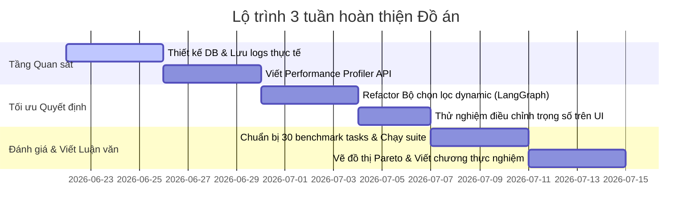

# BÁO CÁO TIẾN ĐỘ NGHIÊN CỨU & LỘ TRÌNH ĐỒ ÁN
**Đề tài:** Framework Đánh Giá và Tối Ưu Hóa Lựa Chọn Kỹ Năng Cho AI Agent
**Phân tầng:** Tái thiết kế `skill_testing` thành Môi trường Thử nghiệm (Testbed & Validator)

---

## 1. PHẠM VI NGHIÊN CỨU (RESEARCH SCOPE)

### 🎯 In-Scope (Nội dung tập trung thực hiện)
*   **Đánh giá và mô hình hóa chất lượng Skill (Trọng tâm cốt lõi):** Tập trung vào việc đánh giá chất lượng (TSR, Cost, Latency) và xây dựng mô hình dự báo hiệu năng của các Skills riêng lẻ, thay vì điều phối hay giao tiếp Multi-Agent phức tạp.
*   **Lý thuyết tối ưu hóa quyết định:** Nghiên cứu lý thuyết tối ưu hóa quyết định (*Decision Optimization*) và bài toán phân bổ tài nguyên (*Resource Allocation*) đa mục tiêu để chọn ra Skill tối ưu nhất cho từng bối cảnh.
*   **Thiết kế Framework quản trị chất lượng:** Phát triển 3 module cốt lõi:
    1.  *Skill Benchmarking:* Định lượng hiệu quả skill qua các chỉ số đo lường thực tế.
    2.  *Skill Modeling:* Mô hình hóa hiệu năng thực tế và xác suất thành công của skill $P(\text{success} \mid \text{task}, \text{skill})$ dựa trên lịch sử chạy.
    3.  *Context-Aware Skill Selection:* Lựa chọn skill thông minh giải quyết bài toán Trade-off (Chất lượng vs. Chi phí).
*   **Thực nghiệm đối chứng:** Đo lường và đánh giá hệ thống trên tập benchmark mẫu (các testcases lỗi Java/Python sẵn có).

### 🚫 Out-of-Scope (Nội dung không bao gồm)
*   Không thiết kế các cơ chế điều phối/giao tiếp Multi-Agent phức tạp (Chỉ tập trung vào chất lượng Skill đơn lẻ của Agent).
*   Không tập trung vào việc huấn luyện lại (*retrain*) hoặc tinh chỉnh (*fine-tune*) các mô hình ngôn ngữ lớn (LLM) nền tảng.
*   Không tối ưu hóa tầng bộ nhớ đệm ngữ cảnh (*semantic caching*).
*   *Mở rộng tương lai (Future Work nếu có thời gian):* Tích hợp LLM Cascade (thay đổi linh hoạt dòng LLM model nền đứng sau Skill để tối ưu hóa chi phí chạy).

---

## 2. CÂU HỎI NGHIÊN CỨU & GIẢ THUYẾT (RESEARCH QUESTIONS & HYPOTHESES)

### ❓ Research Questions (RQ)
*   **RQ1:** Làm thế nào để định lượng hiệu năng thực tế của skill từ Execution Logs?
*   **RQ2:** Làm thế nào để mô hình hóa xác suất thành công và chi phí kỳ vọng của skill theo từng ngữ cảnh?
*   **RQ3:** Làm thế nào để tối ưu việc lựa chọn skill dưới các mục tiêu xung đột về chất lượng (TSR), chi phí (Token Cost) và độ trễ (Latency)?

### 💡 Hypotheses (H)
*   **H1:** Benchmarking dựa trên Execution Logs tạo ra đánh giá ổn định và phản ánh chính xác hiệu năng thực tế của skill.
*   **H2:** Skill Modeling có thể dự đoán TSR, Token Cost và Latency với sai số dưới $\epsilon$.
*   **H3:** Context-Aware Skill Selection giúp tăng TSR, giảm Token Cost, và giảm Latency so với *Zero-shot Selection* và *Semantic Search Selection*.

---

## 3. KẾ HOẠCH HÀNH ĐỘNG SẮP TỚI (UPDATED SPRINT ROADMAP)

Mục tiêu chặng này là hoàn thiện tầng đánh giá (Evaluation Protocol), thiết lập đường ống thu thập log (Execution Logging Pipeline), xây dựng trình chạy tự động (Benchmark Runner) và lấy về kết quả đối chứng đầu tiên (First Experimental Result).

### 📋 Danh sách công việc (Todo List)
- [x] **Task 3:** Thiết lập Giao thức Đánh giá (DoD 3 – Evaluation Protocol)
- [ ] **Task 4:** Xây dựng Đường ống ghi Log (DoD 4 – Execution Logging Pipeline)
- [ ] **Task 5:** Viết Trình chạy Benchmark (DoD 5 – Benchmark Runner)
- [ ] **Task 6:** Thu thập kết quả thực nghiệm đầu tiên (DoD 6 – First Experimental Result)
- [ ] **Task 7:** Tổng hợp và đọc tài liệu nghiên cứu liên quan (Related Papers)

---

## 4. ĐỊNH NGHĨA HOÀN THÀNH (DEFINITION OF DONE - DoD)

Để đảm bảo tính chính xác khoa học và khả năng nghiệm thu của luận văn, mỗi task trong chặng khởi động bắt buộc phải đạt các tiêu chí sau:

### DoD 1: Chốt RQ
*   [x] Xác nhận hệ thống câu hỏi nghiên cứu gồm 3 RQs (RQ1 về định lượng hiệu năng, RQ2 về mô hình hóa ngữ cảnh, RQ3 về tối ưu đa mục tiêu).
*   [x] Xác nhận hệ thống giả thuyết gồm 3 Hypotheses (H1 về tính ổn định của logs, H2 về tính dự đoán với sai số $\epsilon$, H3 về hiệu quả so với Baselines).

### DoD 2: Chốt Baseline & Benchmark Schema
*   [x] Định nghĩa cấu trúc Schema của một Benchmark Instance gồm:
    ```yaml
    task_id: bug_001
    task_type: bug_fixing
    difficulty: medium
    context_profile:
      budget: low
      deadline: normal
    optimization_weights:
      success_rate: 0.3
      token_cost: 0.6
      latency: 0.1
    input_data:
      bug_report: |
        Application crashes when input is empty
      source_code: |
        def process(x):
            return x[0]
    ground_truth_output:
      def process(x):
          if len(x)==0:
              return None
          return x[0]
    ```
*   [x] **Xác định rõ 4 cấu hình Baselines đối chứng (B1 đến B4):**
    *   *B1 (Static Agent / Single Best Solver):* Chọn duy nhất một skill tổng quát tốt nhất trung bình và áp dụng cố định cho mọi tác vụ.
    *   *B2 (Modern RAG Agent):* Kết hợp giữa Vector Search (lọc ra Top-K skill liên quan nhất) và mô hình LLM tự quyết định chọn 1 skill từ Top-K đó.
    *   *B3 (Cost-Blind Agent):* Lựa chọn skill dựa hoàn toàn trên xác suất thành công từ lịch sử logs trong quá khứ, bất kể chi phí token hay độ trễ.
    *   *B4 (Proposed Framework):* Bộ chọn lọc tối ưu hóa đa mục tiêu (Cân bằng giữa tỷ lệ thành công - chi phí token - độ trễ + Bỏ LLM khi Parameter Resolver tự trích xuất được).

### 🛠️ Thiết kế Skill Modeling Layer (Dự phóng hiệu năng)
*   **Định hướng thiết kế:** Do số lượng dữ liệu benchmark ban đầu khá ít (Prototype-driven), việc áp dụng các mô hình Machine Learning phức tạp (XGBoost, Random Forest) sẽ dễ bị học vẹt (overfitting). Do đó, hệ thống sẽ ưu tiên sử dụng các mô hình thống kê và mô hình Bayesian để dự báo hiệu năng.
*   **Thuật toán lựa chọn tối ưu:** 
    *   *M0 - Historical Average:* Tính trung bình cộng hiệu năng lịch sử của từng Skill (làm Baseline).
    *   *M4 - Bayesian Beta-Binomial Modeling (Mô hình ưu tiên):*
        *   **Cách hoạt động dễ hiểu:** 
            1.  Bắt đầu với một "niềm tin ban đầu" (Prior) khi chưa có nhiều logs: giả định một Skill có tỷ lệ thành công là 50% ($\text{Beta}(1,1)$).
            2.  Mỗi khi Skill được chạy thực tế, kết quả (Thành công/Thất bại) từ Execution Logs sẽ được cộng dồn trực tiếp vào mô hình để cập nhật "niềm tin mới" (Posterior): $\alpha = 1 + \text{successes}$, $\beta = 1 + \text{failures}$.
            3.  Xác suất thành công kỳ vọng của Skill sẽ được tính bằng: $P(\text{success}) = \frac{\alpha}{\alpha + \beta}$.
        *   **Ưu điểm:** Khắc phục triệt để vấn đề dữ liệu ít (Cold Start), không sợ overfitting, mô hình tự học và chính xác dần theo thời gian khi tích lũy thêm logs chạy thực tế.
*   **Prior-Based Cold Start & Fallback Policy (Xử lý khi thiếu dữ liệu):**
    *   *Success Prior:* Phân phối Beta(1,1) (Mean = 0.5, độ bất định cao).
    *   *Cost Prior / Latency Prior:* Lấy trung bình toàn cục (Global Average) trên toàn bộ skill cùng loại.
    *   *Fallback Policy:* Nếu số lượt chạy thực tế của Skill trên loại Task đó $N_{\text{run}} < 5$, kết hợp Prior Model + Tìm kiếm các Task tương đồng ngữ nghĩa trong quá khứ (Semantic Similarity). Nếu $N_{\text{run}} \ge 5$, dùng trực tiếp mô hình Bayesian đã cập nhật.
*   **Prediction Targets:** Dự báo xác suất thành công $P(\text{success} \mid \text{context}, \text{skill})$, chi phí kỳ vọng $E(\text{cost})$, và độ trễ kỳ vọng $E(\text{latency})$.

### DoD 3: Thiết lập Giao thức Đánh giá (Evaluation Protocol)
*   [x] Chốt công thức định lượng **Output Quality** $[0, 1]$ cho từng Task Type:
    *   *Bug Fixing:* $\text{Quality} = \text{PassedTests} / \text{TotalTests}$.
    *   *Unit Test Generation:* Test Coverage Score hoặc Mutation Score.
    *   *Code Explanation:* Semantic Similarity hoặc LLM Judge.
    *   *Code Review:* Recall của lỗi phát hiện được.
*   [x] Thiết lập quy tắc tính **Reference Point** cố định cho Hypervolume:
    *   $\text{Reference} = 1.2 \times \text{WorstObserved}$ thu được trên tập train/benchmark (lưu cố định trong suốt quá trình chạy thực nghiệm).
*   [x] Hoàn thành định nghĩa toán học và code tính **Gap Closure** dựa trên SBS (gốc) và VBS (trần).
*   [x] Phân chia tập dữ liệu Benchmark (Dataset Split) rõ ràng để huấn luyện và chạy đối chứng.

### DoD 4: Đường ống ghi Log thực thi (Execution Logging Pipeline)
*   [ ] Khai báo xong lớp ORM `AgentExecutionLog` trong file `backend/shared/models.py`.
*   [ ] Hỗ trợ **Dual-level Logging** để phân tách log lỗi (Credit Assignment):
    *   *Skill-Level:* Thu thập metrics của toàn bộ Composite Skill.
    *   *Subskill-Level:* Ghi chi tiết metrics của từng Atomic Skill con trong chuỗi thực thi.
*   [ ] Tích hợp code ghi logs thành công tại `execute_node.py` xuống SQLite.

### DoD 5: Trình chạy Benchmark tự động (Benchmark Runner)
*   [ ] Xây dựng code tự động hóa đọc kịch bản từ tập Benchmark, khởi tạo sandbox, và kích hoạt Agent xử lý.
*   [ ] Tự động chạy tuần tự các testcases và lưu trữ trực tiếp metrics vào DB.

### DoD 6: Kết quả thực nghiệm đầu tiên (First Experimental Result)
*   [ ] Cài đặt thành công 2 thuật toán mô hình hóa: Historical Average (M0) và Logistic Regression (M1).
*   [ ] Thực hiện chạy thử nghiệm 30 testcases qua các Baselines.
*   [ ] Xuất ra bảng kết quả đối chứng đầu tiên so sánh các chỉ số: TSR, Cost, Latency, Hypervolume (HV), VBS Gap, và Gap Closure.

### DoD 7: Đọc paper liên quan
*   [ ] Thu thập tối thiểu 3-5 bài báo khoa học chất lượng về *Algorithm Selection* hoặc *Multi-Objective Optimization*.
*   [ ] Trích dẫn các nghiên cứu này để làm phong phú thêm chương Cơ sở lý thuyết của luận văn.

---

## 5. LỘ TRÌNH 3 TUẦN VẬN HÀNH ĐỒ ÁN (3-WEEK ACTION ROADMAP)



| Hạng mục công việc | Độ ưu tiên (Priority) | Thời gian dự kiến (Effort) | Rủi ro (Risk) | Hạn hoàn thành (Deadline) |
| :--- | :---: | :---: | :---: | :---: |
| **Tuần 1: Observability & Profiling**<br/>Hoàn thiện hạ tầng lưu trữ logs chạy thực tế và API tổng hợp Performance Profile. | **High** | 6 ngày | Thấp | 2026-06-29 |
| **Tuần 2: Dynamic Selection Engine**<br/>Cập nhật bộ chọn lọc dynamic trong LangGraph sử dụng hồ sơ hiệu năng lịch sử và công thức tối ưu hóa đa mục tiêu. | **High** | 7 ngày | Trung bình | 2026-07-06 |
| **Tuần 3: Benchmark, Analytics & Thesis**<br/>Chạy 30 testcases qua 3 Baselines, vẽ đồ thị đối chứng và hoàn thiện chương thực nghiệm của luận văn. | **High** | 8 ngày | Thấp | 2026-07-14 |
